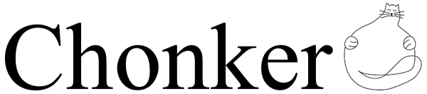

  

Chonker is a lightweith python package that makes it easy to chunkify your data.

Benefits of chonker are:
* Simple and flexible user interface
* Performant implementation using iterables

The design of chonker exposes chunking logic directly to the user
resulting in readable and extensible code.
The entire chonker api can be expressed in a single example snippet:

    from chonker import chonkify

    for chonk, row in chonkify(data, size=100):
        print(chonk.size, chonk.index, chonk.subindex, chonk.rawindex)
        if chonk.is_start_of:
            print('Do something at the start of the chunk')
        elif chonk.is_end_of:
            print('Do something at the end of the chunk')

A common use case for chonker is checkpointing

    data = []
    for chonk, row in chonkify(data, size=100):
        data.append(process(row))
        if chonk.is_end_of:
            checkpoint(data)

Notice how this code looks similar to the equivalent code using enumerate

    data = []
    chunksize = 100
    for idx, row in enumerate(data):
        data.append(process(row))
        if idx%chunksize==len(data)-1:
            checkpoint(data)

Chonkers power is hidden in it's simplicity.
The simalarities between enumerate and chonkify make it easy to adopt.
The chonking syntax is readable, while abstracting out the use of // and % avoids common errors with indexing.
Chonk objects a dataclasses that can be pretty printed, compared, and stored with your data if you like.
Note that chonk objects are reused between iterations for performance reasons;
don't modify chonks unless you understand the implications.

## Design considerations
The design of chonker was inspired by the tqdm library and by unix philosophy, e.g., do one simple thing and do it well.
The design was also inspired by the python built-in enumerate.
The name chonk is chosen specifically to distinguish the chonk data structure from the concept of a chunk.
A chunk is a subset of data from a larger dataset.
A chonk is a data structure that augements the indexes of an iteration.

The authors of chonker considered other designs.
The standard chunking approch usually looks like

    from chunker import chunkify

    for chunk in chunkify(data, chunksize=100):
        do_something_special(chunk[0])
        for row in chunk[1:-1]:
            do_something_normal(row)
        do_something_els(chunk[-1])

This approach isn't particularly readable.
With dealing with iterables this approach becomes even less readable.

Another common approach is to use callbacks like

    from callchunk import chunkify

    for row in chunkify(data, chunksize=100, start_callback=do_something_special, end_callback=do_something_else, skip_first=True, skip_last=True):
        do_something_normal(row)

This approach is even less readable and has a downside that the user can only specify a callback for predetermined events.

These two approaches share a common pitfall, they try to hide too much logic from the user.
With chonker the user is exposed to the right level of abstraction and can handle their events as they see fit.
